<div align="center">

# 🚀 Hackaton Alabuga

**Современная система управления миссиями и геймификации для корпоративного обучения**

**🐍 Python 3.13+** | **⚡ FastAPI 0.116+** | **🐘 PostgreSQL 17+** | **🐳 Docker Compose**

**🏗️ Clean Architecture** | **🧪 Pytest + Coverage** | **🔍 MyPy + Ruff**

</div>

---

## 🎯 О проекте

**Hackaton Alabuga** — это инновационная платформа для корпоративного обучения, построенная на принципах геймификации. Система позволяет создавать миссии, цепочки задач, управлять компетенциями и навыками сотрудников, а также отслеживать их прогресс через систему рангов и артефактов.

Платформа собирает разрозненные задания сотрудников и кандидатов в понятные ветки миссий. В каждом сезоне у компании есть общая цель, а у человека - свой маршрут: ветка «Рекрутинг» при входе, затем «Стажировка», далее профессиональные треки. Каждая миссия - конкретное действие с проверкой результата. Это даёт пользу цехам (порядок на участке, уменьшение брака, экономия времени), ИТ-командам (быстрее сборки и релизы), продукту (интервью и честные эксперименты). Наставничество оформлено как парные миссии с двумя совместными отметками и взаимной оценкой - так фиксируется реальная передача опыта.
Мы опирались на исследования мотивации (свобода выбора, рост мастерства, связь с командой), на практики 5с и кайдзен в производстве, на четыре ключевые инженерные метрики в разработке, и на руководства по надёжным A/B-экспериментам

Ссылка на исследование продукта: [Figma](https://www.figma.com/board/h5k5M1Te6EhWR7eK9Anfv9/LCT2025?node-id=0-1&p=f&t=9j3LowR1GH1ljxxZ-0)
Ссылка на дизайн продукта: [Figma](https://www.figma.com/design/dcU6R5bf8Igjhhx0jf2CB2/LCT_ALABUGA?node-id=0-1&p=f&t=xjmIvUbIrZmHnwdo-0)

### ✨ Ключевые возможности

- 🎮 **Геймификация обучения** — миссии, ранги, артефакты и система опыта
- 🔗 **Цепочки миссий** — связанные задачи с зависимостями
- 🏆 **Система компетенций** — структурированное развитие навыков
- 👥 **Роли и права доступа** — разделение на пользователей и HR
- 🛒 **Внутренний магазин** — покупка товаров за игровую валюту
- 📱 **RESTful API** — современный интерфейс для интеграций
- 🔒 **JWT аутентификация** — безопасный доступ к системе

---

## 📚 API Документация

Документация приложения и UI доступны по адресам:

- **Swagger UI**: http://91.219.150.15
- **Frontend**: http://91.219.150.15:3000
---

## 🛠 Технологический стек

### 🚀 Backend
- **FastAPI 0.116+** — современный веб-фреймворк для Python
- **Pydantic v2** — валидация данных и сериализация
- **SQLAlchemy 2.0+** — ORM для работы с базой данных
- **Alembic 1.16+** — миграции базы данных
- **Dishka** — контейнер зависимостей

### 🗄️ Database & Storage
- **PostgreSQL 17+** — основная база данных
- **MinIO** — S3-совместимое хранилище файлов
- **AsyncPG 0.30+** — асинхронный драйвер PostgreSQL

### 🔐 Security & Auth
- **JWT (PyJWT)** — токены аутентификации
- **BCrypt** — хеширование паролей

### 🔧 DevOps & Tools
- **Docker Compose** — контейнеризация
- **UV** — быстрый менеджер пакетов Python
- **Ruff** — линтер и форматтер кода
- **MyPy** — статическая проверка типов
- **Pytest** — фреймворк тестирования

---

## 🧪 Тестирование

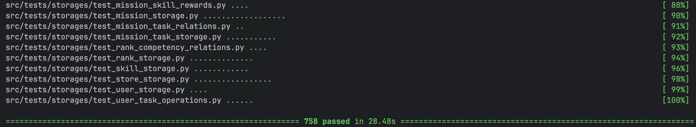

---

### Покрытие кода тестами 91%

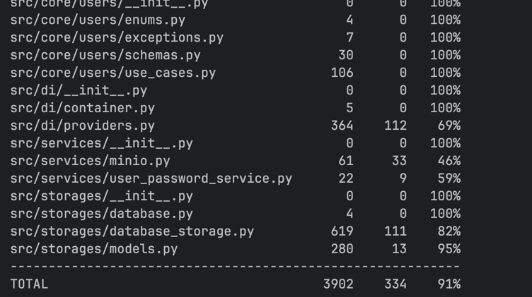

---

## 🚀 Быстрый старт

### Предварительные требования

- **Python 3.13+**
- **Docker & Docker Compose**
- **UV** (рекомендуется для управления зависимостями)

### Установка и запуск

```bash
# Клонирование репозитория
git clone https://github.com/OptikRUS/hackaton_alabuga.git
cd hackaton_alabuga

# Запуск через Docker Compose
make up

# Или запуск локально
# Установка зависимостей
make install

uv run python src/main.py
```

### Переменные окружения

Создайте файл `.env` в корне проекта:

```env
# Database
DB_USER=postgres
DB_PASSWORD=postgres
DB_NAME=alabuga
PG_PORT=15432

# MinIO
MINIO_ROOT_USER=minio
MINIO_ROOT_PASSWORD=minio123
MINIO_PORT=9000
MINIO_CONSOLE_PORT=9001

# Server
SERVER_HOST=0.0.0.0
```

---

## 🏗 Архитектура системы

### Модульная структура

```
src/
├── api/           # API слой (роутеры, контроллеры, схемы)
├── core/          # Бизнес-логика (use cases, доменные сервисы)
├── storages/      # Слой данных (ORM модели, репозитории)
├── services/      # Внешние сервисы (MinIO, пароли)
├── config/        # Конфигурация приложения
├── di/            # Dependency Injection контейнер
└── migrations/    # Миграции базы данных
```

### Архитектурная диаграмма

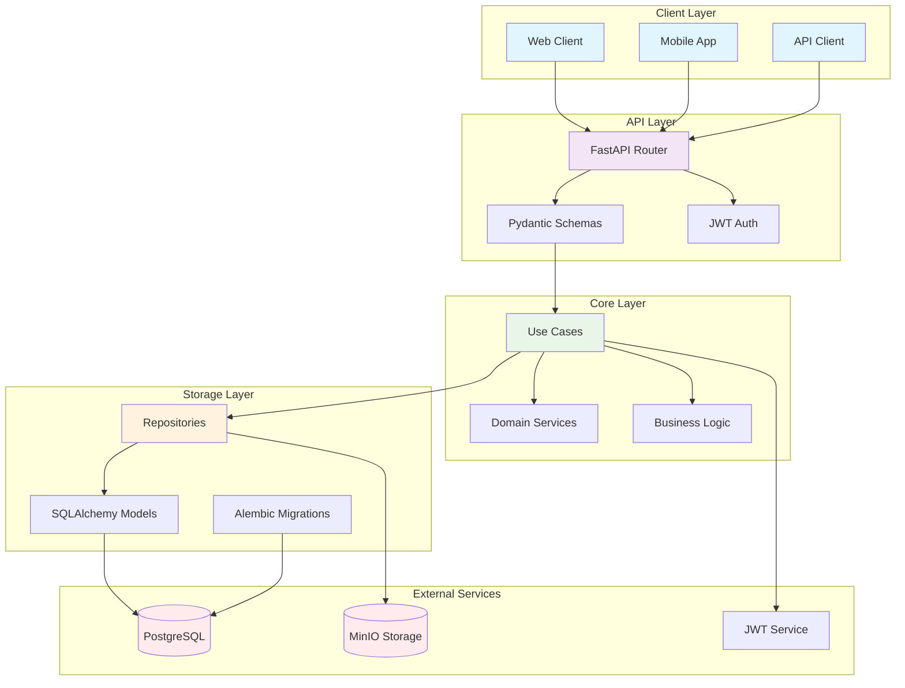

### Принципы архитектуры

- **Clean Architecture** — разделение на слои с четкими границами
- **Dependency Injection** — управление зависимостями через Dishka
- **Repository Pattern** — абстракция доступа к данным
- **Use Case Pattern** — инкапсуляция бизнес-логики

### Диаграммы взаимодействия

#### 🎯 Выполнение миссии пользователем

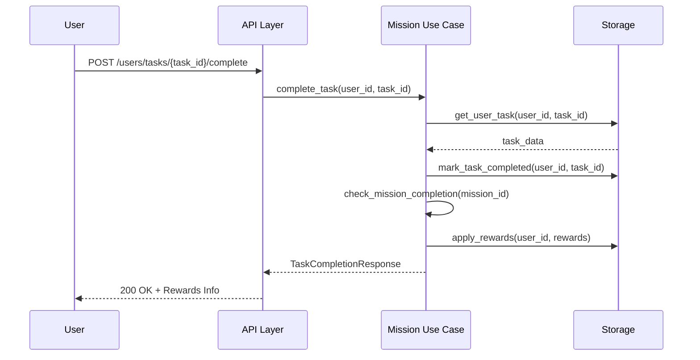

#### 🏆 Система рангов и компетенций

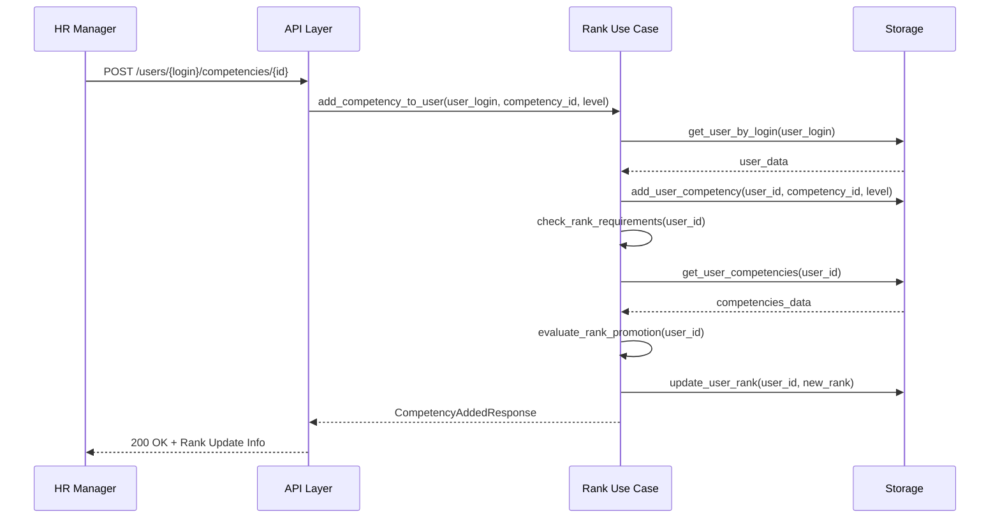

---

## 🎮 Основные модули системы

### 👥 Пользователи
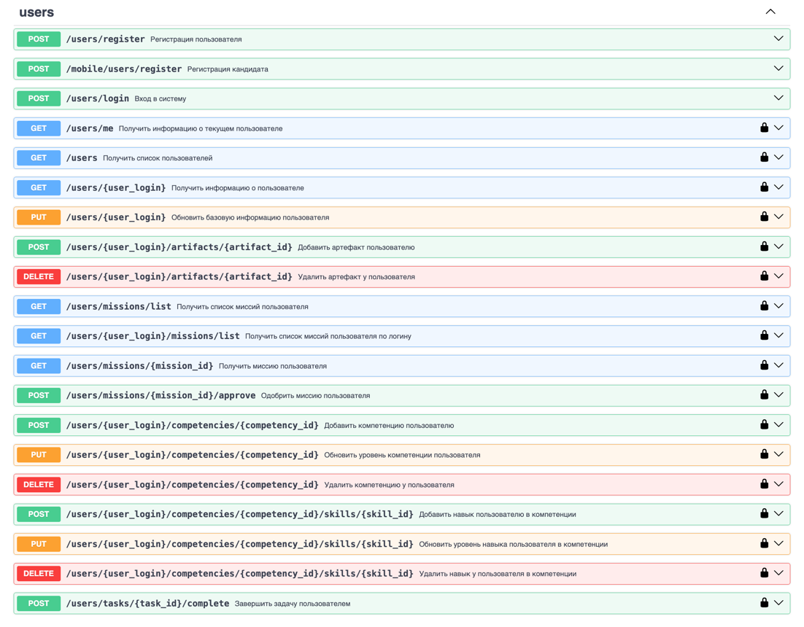

**Управление пользователями и их прогрессом**

- 🔐 Регистрация и аутентификация
- 👤 Профили пользователей с рангами и артефактами
- 📋 Список миссий и задач пользователя
- ✅ Завершение задач и одобрение миссий
- 🎯 Управление компетенциями и навыками

### 🌟 Сезоны
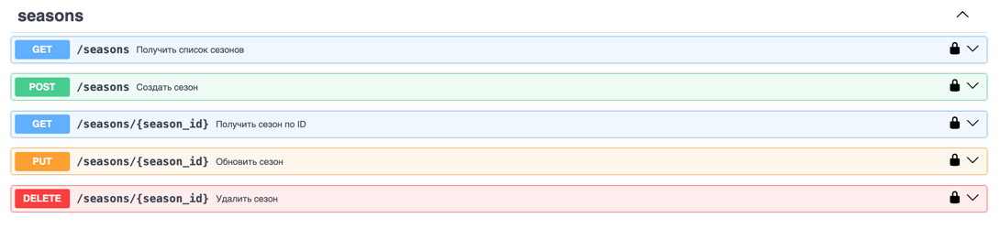

**Временные периоды для организации миссий**

- 📅 Создание и управление сезонами
- ⏰ Планирование активности по периодам
- 🎯 Группировка миссий по сезонам

### 🎯 Миссии
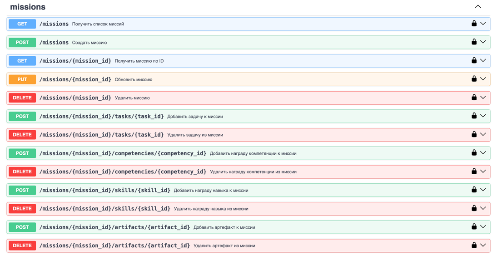

**Основные блоки обучения и развития**

- 📝 Создание и редактирование миссий
- 🎁 Система наград (компетенции, навыки, артефакты)
- 📋 Привязка задач к миссиям
- 🔗 Управление зависимостями между миссиями

### 🔗 Цепочки миссий
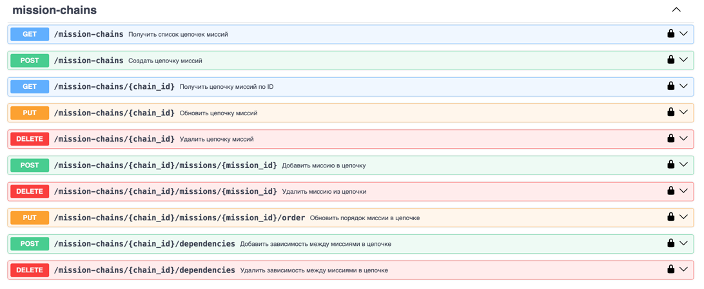

**Связанные последовательности миссий**

- 🔄 Создание цепочек миссий
- 📊 Управление порядком выполнения
- 🔗 Настройка зависимостей между миссиями
- 📈 Отслеживание прогресса по цепочкам

### 📋 Задачи
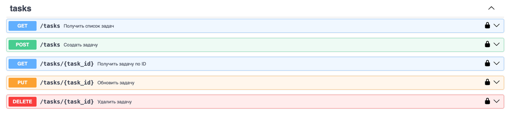

**Конкретные единицы работы**

- ✏️ Создание и редактирование задач
- 📝 Детальное описание требований
- 🎯 Привязка к миссиям и цепочкам

### 🏆 Компетенции
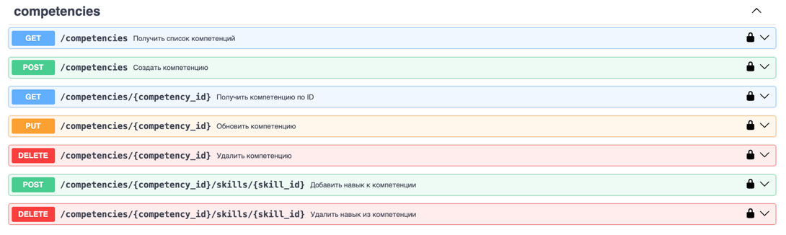

**Области экспертизы и развития**

- 🎯 Определение компетенций
- 🔗 Связывание навыков с компетенциями
- 📊 Уровневая система развития

### 🥇 Ранги
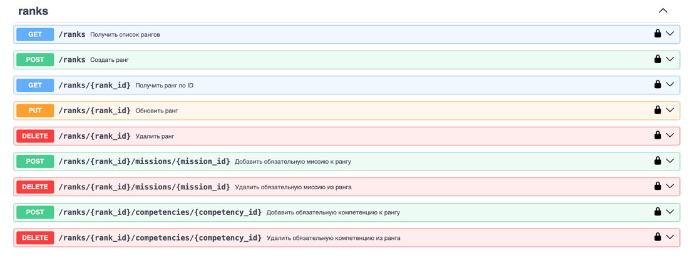

**Система достижений и статусов**

- 🏅 Создание ранговых систем
- 📋 Требования для получения рангов
- 🎯 Обязательные миссии и компетенции

### 🎨 Навыки
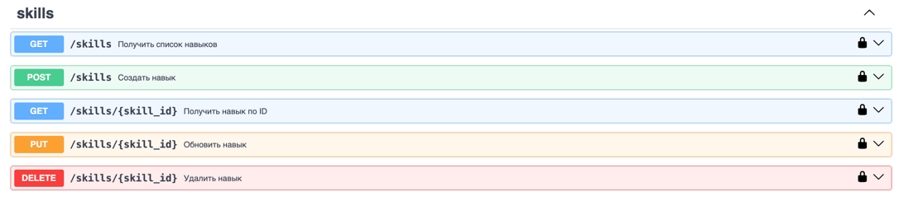

**Конкретные умения и способности**

- 🔧 Управление навыками
- 📈 Система уровней развития
- 🔗 Привязка к компетенциям

### 🛒 Магазин
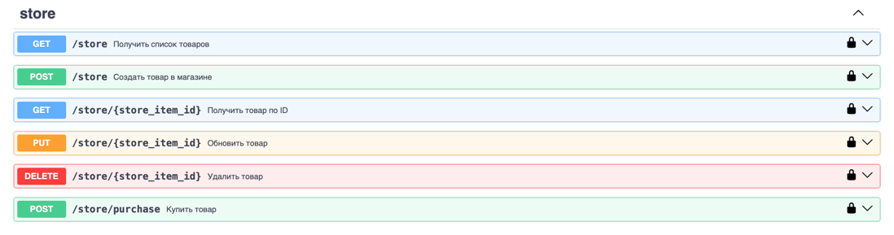

**Внутренняя экономика системы**

- 💰 Покупка товаров за игровую валюту
- 🎁 Управление товарами
- 💳 Система транзакций

### 🏺 Артефакты
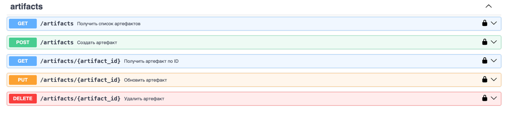

**Цифровые достижения и награды**

- 🏆 Создание и управление артефактами
- 🎁 Награждение пользователей
- 📊 Коллекционирование достижений

### 📁 Медиа
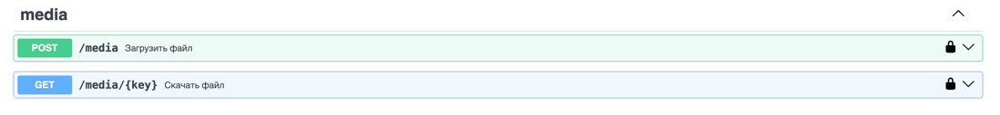

**Управление файлами и медиа-контентом**

- 📤 Загрузка файлов в MinIO
- 🔗 Связывание медиа с пользователями
- 📱 API для доступа к медиа-контенту

---

### Запуск тестов

```bash
# Все тесты
make tests

# С покрытием
make tests-coverage

# Конкретный модуль
uv run pytest src/tests/core/users/

# API тесты
uv run pytest src/tests/api/
```

### Структура тестов

- **API тесты** — интеграционные тесты эндпоинтов
- **Core тесты** — тесты бизнес-логики (use cases)
- **Storage тесты** — тесты слоя данных
- **Fixtures** — переиспользуемые тестовые данные

---

## 🔧 Разработка

### Установка зависимостей для разработки

```bash
make install
```

### Линтеры и форматтеры

```bash
# Проверка кода
make lint
make types

# Автоисправление
make fix

# Полная проверка качества
make quality
```

### Миграции базы данных

```bash
# Создание миграции
make migrations

# Применение миграций
make migrate

# Откат миграции
make downgrade
```

---

## 📊 Мониторинг и логирование

- **Структурированные логи** через `structlog`
- **Health checks** для всех сервисов
- **Метрики производительности** в API
- **Автоматические бэкапы** PostgreSQL

---

<div align="center">

**Сделано с ❤️ для корпоративного обучения**

**🐙 GitHub** | **🐳 Docker Hub** | **📚 Документация**

</div>
