<div align="center">

# 🚀 Hackaton Alabuga

**Современная система управления миссиями и геймификации для корпоративного обучения**

**🐍 Python 3.13+** | **⚡ FastAPI 0.116+** | **🐘 PostgreSQL 17+** | **🐳 Docker Compose**

**🏗️ Clean Architecture** | **🧪 Pytest + Coverage** | **🔍 MyPy + Ruff**

</div>

---

## 📋 Содержание

- [🎯 О проекте](#-о-проекте)
  - [✨ Ключевые возможности](#-ключевые-возможности)
- [🔗 Репозитории проекта](#-репозитории-проекта)
- [📚 Документация и интерфейсы](#-документация-и-интерфейсы)
- [🛠 Технологический стек](#-технологический-стек)
  - [🚀 Backend](#-backend)
  - [🗄️ Database & Storage](#️-database--storage)
  - [🔐 Security & Auth](#-security--auth)
  - [🔧 DevOps & Tools](#-devops--tools)
- [🧪 Тестирование](#-тестирование)
  - [Покрытие кода тестами 91%](#покрытие-кода-тестами-91)
  - [Запуск тестов](#запуск-тестов)
  - [Структура тестов](#структура-тестов)
- [🚀 Быстрый старт](#-быстрый-старт)
  - [Предварительные требования](#предварительные-требования)
  - [Установка и запуск](#установка-и-запуск)
  - [Переменные окружения](#переменные-окружения)
- [🏗 Архитектура системы](#-архитектура-системы)
  - [Модульная структура](#модульная-структура)
  - [Архитектурная диаграмма](#архитектурная-диаграмма)
  - [Принципы архитектуры](#принципы-архитектуры)
  - [ERD - Диаграмма базы данных](#erd---диаграмма-базы-данных)
  - [Диаграммы взаимодействия](#диаграммы-взаимодействия)
    - [🎯 Выполнение миссии пользователем](#-выполнение-миссии-пользователем)
    - [🏆 Система рангов и компетенций](#-система-рангов-и-компетенций)
- [🎮 Основные модули системы](#-основные-модули-системы)
  - [👥 Пользователи](#-пользователи)
  - [🌟 Сезоны](#-сезоны)
  - [🎯 Миссии](#-миссии)
  - [🔗 Цепочки миссий](#-цепочки-миссий)
  - [📋 Задачи](#-задачи)
  - [🏆 Компетенции](#-компетенции)
  - [🥇 Ранги](#-ранги)
  - [🎨 Навыки](#-навыки)
  - [🛒 Магазин](#-магазин)
  - [🏺 Артефакты](#-артефакты)
  - [📁 Медиа](#-медиа)
- [🔧 Разработка](#-разработка)
  - [Установка зависимостей для разработки](#установка-зависимостей-для-разработки)
  - [Линтеры и форматтеры](#линтеры-и-форматтеры)
  - [Миграции базы данных](#миграции-базы-данных)
- [📊 Мониторинг и логирование](#-мониторинг-и-логирование)

---

## 🎯 О проекте

**Hackaton Alabuga** — это инновационная платформа, которая собирает разрозненные задания сотрудников и кандидатов в понятные ветки миссий. В каждом сезоне у компании есть общая цель, а у человека - свой маршрут: ветка «Рекрутинг» при входе, затем «Стажировка», далее профессиональные треки. Каждая миссия - конкретное действие с проверкой результата. Это даёт пользу цехам (порядок на участке, уменьшение брака, экономия времени), ИТ-командам (быстрее сборки и релизы), продукту (интервью и честные эксперименты). Наставничество оформлено как парные миссии с двумя совместными отметками и взаимной оценкой - так фиксируется реальная передача опыта.
Мы опирались на исследования мотивации (свобода выбора, рост мастерства, связь с командой), на практики 5с и кайдзен в производстве, на четыре ключевые инженерные метрики в разработке, и на руководства по надёжным A/B-экспериментам

- Ссылка на исследование продукта: [Figma](https://www.figma.com/board/h5k5M1Te6EhWR7eK9Anfv9/LCT2025?node-id=0-1&p=f&t=9j3LowR1GH1ljxxZ-0)

- Ссылка на дизайн продукта: [Figma](https://www.figma.com/design/dcU6R5bf8Igjhhx0jf2CB2/LCT_ALABUGA?node-id=0-1&p=f&t=xjmIvUbIrZmHnwdo-0)

### ✨ Ключевые возможности

- 🎮 **Геймификация обучения** — миссии, ранги, артефакты и система опыта
- 🔗 **Цепочки миссий** — связанные задачи с зависимостями
- 🏆 **Система компетенций** — структурированное развитие навыков
- 👥 **Роли и права доступа** — разделение на пользователей и HR
- 🛒 **Внутренний магазин** — покупка товаров за игровую валюту
- 📱 **RESTful API** — современный интерфейс для интеграций
- 🔒 **JWT аутентификация** — безопасный доступ к системе

---

## 🔗 Репозитории проекта

Проект состоит из трех основных компонентов:

- **📱 Мобильное приложение** (Kotlin) — [Ektomo/lct2025](https://github.com/Ektomo/lct2025)
- **⚡ Backend API** (Python/FastAPI) — [OptikRUS/hackaton_alabuga](https://github.com/OptikRUS/hackaton_alabuga)
- **🌐 Frontend** — [salyamii/lct2025-alabuga-app](https://github.com/salyamii/lct2025-alabuga-app)

---

## 📚 Документация и интерфейсы

Документация приложения и UI доступны по адресам:

- **Swagger UI**: http://91.219.150.15
- **Frontend**: http://91.219.150.15:3000
---

## 🛠 Технологический стек

### 🚀 Backend
- **FastAPI 0.116+** — современный веб-фреймворк для Python
- **Pydantic v2** — валидация данных и сериализация
- **SQLAlchemy 2.0+** — ORM для работы с базой данных
- **Alembic 1.16+** — миграции базы данных
- **Dishka** — контейнер зависимостей

### 🗄️ Database & Storage
- **PostgreSQL 17+** — основная база данных
- **MinIO** — S3-совместимое хранилище файлов
- **AsyncPG 0.30+** — асинхронный драйвер PostgreSQL

### 🔐 Security & Auth
- **JWT (PyJWT)** — токены аутентификации
- **BCrypt** — хеширование паролей

### 🔧 DevOps & Tools
- **Docker Compose** — контейнеризация
- **UV** — быстрый менеджер пакетов Python
- **Ruff** — линтер и форматтер кода
- **MyPy** — статическая проверка типов
- **Pytest** — фреймворк тестирования

---

## 🧪 Тестирование

> 758 тестов покрывающие бизнес логику и базовый функционал


---

### Покрытие кода тестами 91%


---

## 🚀 Быстрый старт

### Предварительные требования

- **Python 3.13+**
- **Docker & Docker Compose**
- **UV** (рекомендуется для управления зависимостями)

### Установка и запуск

```bash
# Клонирование репозитория
git clone https://github.com/OptikRUS/hackaton_alabuga.git
cd hackaton_alabuga

# Запуск через Docker Compose
make up

# Или запуск локально
# Установка зависимостей
make install

uv run python src/main.py
```

### Переменные окружения

Создайте файл `.env` в корне проекта:

```env
# Database
DB_USER=postgres
DB_PASSWORD=postgres
DB_NAME=alabuga
PG_PORT=15432

# MinIO
MINIO_ROOT_USER=minio
MINIO_ROOT_PASSWORD=minio123
MINIO_PORT=9000
MINIO_CONSOLE_PORT=9001

# Server
SERVER_HOST=0.0.0.0
```

---

## 🏗 Архитектура системы

### Модульная структура

```
src/
├── api/           # API слой (роутеры, контроллеры, схемы)
├── core/          # Бизнес-логика (use cases, доменные сервисы)
├── storages/      # Слой данных (ORM модели, репозитории)
├── services/      # Внешние сервисы (MinIO, пароли)
├── config/        # Конфигурация приложения
├── di/            # Dependency Injection контейнер
└── migrations/    # Миграции базы данных
```

### Архитектурная диаграмма


### Принципы архитектуры

- **Clean Architecture** — разделение на слои с четкими границами
- **Dependency Injection** — управление зависимостями через Dishka
- **Repository Pattern** — абстракция доступа к данным
- **Use Case Pattern** — инкапсуляция бизнес-логики

### ERD - Диаграмма базы данных

```mermaid
erDiagram
    %% Основные сущности
    UserModel {
        string login PK
        string password
        string role
        int rank_id FK
        int exp
        int mana
        string first_name
        string last_name
    }
    
    MissionBranchModel {
        int id PK
        string name UK
        datetime start_date
        datetime end_date
    }
    
    MissionModel {
        int id PK
        string title UK
        string description
        int reward_xp
        int reward_mana
        int rank_requirement
        string category
        int branch_id FK
    }
    
    MissionTaskModel {
        int id PK
        string title UK
        string description
    }
    
    CompetencyModel {
        int id PK
        string name UK
        int max_level
    }
    
    SkillModel {
        int id PK
        string name UK
        int max_level
    }
    
    RankModel {
        int id PK
        string name UK
        int required_xp
        string image_url
    }
    
    ArtifactModel {
        int id PK
        string title UK
        string description
        string rarity
        string image_url
    }
    
    MissionChainModel {
        int id PK
        string name UK
        string description
        int reward_xp
        int reward_mana
    }
    
    StoreItemModel {
        int id PK
        string title UK
        int price
        int stock
        string image_url
    }
    
    %% Связи Many-to-Many
    MissionTaskRelationModel {
        int task_id PK,FK
        int mission_id PK,FK
    }
    
    ArtifactMissionRelationModel {
        int artifact_id PK,FK
        int mission_id PK,FK
    }
    
    ArtifactUserRelationModel {
        int artifact_id PK,FK
        string user_login PK,FK
    }
    
    RankMissionRelationModel {
        int rank_id PK,FK
        int mission_id PK,FK
    }
    
    CompetencySkillRelationModel {
        int competency_id PK,FK
        int skill_id PK,FK
    }
    
    MissionChainMissionRelationModel {
        int mission_chain_id PK,FK
        int mission_id PK,FK
        int order
    }
    
    %% Связи One-to-Many
    UserTaskRelationModel {
        int task_id PK,FK
        string user_login PK,FK
        boolean is_completed
    }
    
    UserMissionApprovalModel {
        int mission_id PK,FK
        string user_login PK,FK
        boolean is_approved
        datetime approved_at
    }
    
    UserSkillModel {
        string user_login PK,FK
        int skill_id PK,FK
        int competency_id PK,FK
        int level
    }
    
    UserCompetencyModel {
        string user_login PK,FK
        int competency_id PK,FK
        int level
    }
    
    RankCompetencyRequirementModel {
        int rank_id PK,FK
        int competency_id PK,FK
        int min_level
    }
    
    MissionCompetencyRewardModel {
        int mission_id PK,FK
        int competency_id PK,FK
        int level_increase
    }
    
    MissionSkillRewardModel {
        int mission_id PK,FK
        int skill_id PK,FK
        int level_increase
    }
    
    MissionDependencyModel {
        int mission_chain_id PK,FK
        int mission_id PK,FK
        int prerequisite_mission_id PK,FK
    }
    
    %% Основные связи
    MissionBranchModel ||--o{ MissionModel : "содержит"
    UserModel }o--|| RankModel : "имеет ранг"
    
    %% Many-to-Many связи
    MissionModel ||--o{ MissionTaskRelationModel : "связана с задачами"
    MissionTaskModel ||--o{ MissionTaskRelationModel : "входит в миссии"
    
    MissionModel ||--o{ ArtifactMissionRelationModel : "награждает артефактами"
    ArtifactModel ||--o{ ArtifactMissionRelationModel : "награда за миссии"
    
    UserModel ||--o{ ArtifactUserRelationModel : "владеет артефактами"
    ArtifactModel ||--o{ ArtifactUserRelationModel : "принадлежит пользователям"
    
    RankModel ||--o{ RankMissionRelationModel : "требует миссии"
    MissionModel ||--o{ RankMissionRelationModel : "требуется для ранга"
    
    CompetencyModel ||--o{ CompetencySkillRelationModel : "содержит навыки"
    SkillModel ||--o{ CompetencySkillRelationModel : "входит в компетенции"
    
    MissionChainModel ||--o{ MissionChainMissionRelationModel : "содержит миссии"
    MissionModel ||--o{ MissionChainMissionRelationModel : "входит в цепочки"
    
    %% One-to-Many связи
    UserModel ||--o{ UserTaskRelationModel : "выполняет задачи"
    MissionTaskModel ||--o{ UserTaskRelationModel : "выполняется пользователями"
    
    UserModel ||--o{ UserMissionApprovalModel : "одобряет миссии"
    MissionModel ||--o{ UserMissionApprovalModel : "одобряется пользователями"
    
    UserModel ||--o{ UserSkillModel : "развивает навыки"
    SkillModel ||--o{ UserSkillModel : "развивается пользователями"
    CompetencyModel ||--o{ UserSkillModel : "группирует навыки"
    
    UserModel ||--o{ UserCompetencyModel : "развивает компетенции"
    CompetencyModel ||--o{ UserCompetencyModel : "развивается пользователями"
    
    RankModel ||--o{ RankCompetencyRequirementModel : "требует компетенции"
    CompetencyModel ||--o{ RankCompetencyRequirementModel : "требуется для ранга"
    
    MissionModel ||--o{ MissionCompetencyRewardModel : "награждает компетенциями"
    CompetencyModel ||--o{ MissionCompetencyRewardModel : "награда за миссии"
    
    MissionModel ||--o{ MissionSkillRewardModel : "награждает навыками"
    SkillModel ||--o{ MissionSkillRewardModel : "награда за миссии"
    
    MissionChainModel ||--o{ MissionDependencyModel : "содержит зависимости"
    MissionModel ||--o{ MissionDependencyModel : "зависит от миссий"
```



### Диаграммы взаимодействия

#### 🎯 Выполнение миссии пользователем


#### 🏆 Система рангов и компетенций


---

## 🎮 Основные модули системы

### 👥 Пользователи


**Управление пользователями и их прогрессом**

- 🔐 Регистрация и аутентификация
- 👤 Профили пользователей с рангами и артефактами
- 📋 Список миссий и задач пользователя
- ✅ Завершение задач и одобрение миссий
- 🎯 Управление компетенциями и навыками

### 🌟 Сезоны


**Временные периоды для организации миссий**

- 📅 Создание и управление сезонами
- ⏰ Планирование активности по периодам
- 🎯 Группировка миссий по сезонам

### 🎯 Миссии


**Основные блоки обучения и развития**

- 📝 Создание и редактирование миссий
- 🎁 Система наград (компетенции, навыки, артефакты)
- 📋 Привязка задач к миссиям
- 🔗 Управление зависимостями между миссиями

### 🔗 Цепочки миссий


**Связанные последовательности миссий**

- 🔄 Создание цепочек миссий
- 📊 Управление порядком выполнения
- 🔗 Настройка зависимостей между миссиями
- 📈 Отслеживание прогресса по цепочкам

### 📋 Задачи


**Конкретные единицы работы**

- ✏️ Создание и редактирование задач
- 📝 Детальное описание требований
- 🎯 Привязка к миссиям и цепочкам

### 🏆 Компетенции


**Области экспертизы и развития**

- 🎯 Определение компетенций
- 🔗 Связывание навыков с компетенциями
- 📊 Уровневая система развития

### 🥇 Ранги


**Система достижений и статусов**

- 🏅 Создание ранговых систем
- 📋 Требования для получения рангов
- 🎯 Обязательные миссии и компетенции

### 🎨 Навыки


**Конкретные умения и способности**

- 🔧 Управление навыками
- 📈 Система уровней развития
- 🔗 Привязка к компетенциям

### 🛒 Магазин


**Внутренняя экономика системы**

- 💰 Покупка товаров за игровую валюту
- 🎁 Управление товарами
- 💳 Система транзакций

### 🏺 Артефакты


**Цифровые достижения и награды**

- 🏆 Создание и управление артефактами
- 🎁 Награждение пользователей
- 📊 Коллекционирование достижений

### 📁 Медиа


**Управление файлами и медиа-контентом**

- 📤 Загрузка файлов в MinIO
- 🔗 Связывание медиа с пользователями
- 📱 API для доступа к медиа-контенту

---

### Запуск тестов

```bash
# Все тесты
make tests

# С покрытием
make tests-coverage

# Конкретный модуль
uv run pytest src/tests/core/users/

# API тесты
uv run pytest src/tests/api/
```

### Структура тестов

- **API тесты** — интеграционные тесты эндпоинтов
- **Core тесты** — тесты бизнес-логики (use cases)
- **Storage тесты** — тесты слоя данных
- **Fixtures** — переиспользуемые тестовые данные

---

## 🔧 Разработка

### Установка зависимостей для разработки

```bash
make install
```

### Линтеры и форматтеры

```bash
# Проверка кода
make lint
make types

# Автоисправление
make fix

# Полная проверка качества
make quality
```

### Миграции базы данных

```bash
# Создание миграции
make migrations

# Применение миграций
make migrate

# Откат миграции
make downgrade
```

---

## 📊 Мониторинг и логирование

- **Структурированные логи** через `structlog`
- **Health checks** для всех сервисов
- **Метрики производительности** в API
- **Автоматические бэкапы** PostgreSQL

---

<div align="center">

**Сделано с ❤️ для корпоративного обучения**

**🐙 GitHub** | **🐳 Docker Hub** | **📚 Документация**

</div>
